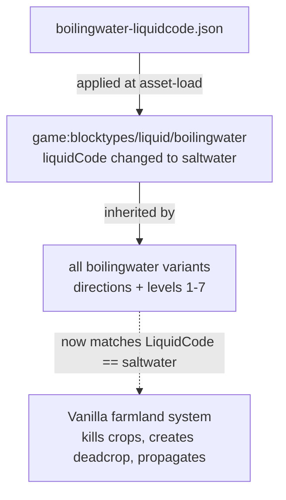

# Design Document

## Overview

Boiling water in hot springs should damage and kill nearby crops exactly the way salt water already does in vanilla Vintage Story. Vanilla's salt water crop damage is **data-driven**: the farmland system (`BESoilNutrition.GetNearbyWaterDistance` → `BEFarmland.updateCropDamage`) scans nearby fluid blocks and flags a fluid as crop-damaging when its top-level `liquidCode` field equals `"saltwater"`. Because the trigger is a block data field rather than hardcoded per-block logic, this feature is a **pure JSON asset patch** that changes the boiling water base block definition's `liquidCode` to `"saltwater"`.

> **Implementation note (verified against game 1.22 vanilla assets + `vssurvivalmod` source).** The originally-proposed `waterType` attribute does **not** exist in vanilla — a full scan of `assets/survival` found no such key, and the farmland code keys salt damage on `Block.LiquidCode == "saltwater"`, not on any attribute. The feature was therefore re-scoped to **Option A**: patch `/liquidCode` from `"boilingwater"` to `"saltwater"`. Trade-off: `liquidCode` also drives other systems (container fill, drinking, freezing, liquid spreading), so boiling water sharing the `saltwater` liquid code may produce side effects in those systems. This was accepted as the chosen approach.

There is **no C# code** in this feature — no `ModSystem` changes, no Harmony patch, no listeners. The mod ships one patch file; the engine applies it at asset-load time, and from then on vanilla's farmland system treats boiling water as salt water for crop damage (radius, timing, dead-crop creation, seed retention, server-side processing, client propagation).

See `.kiro/steering/json-patches.md` for the patch mechanics referenced throughout.

### Two key caveats

1. **The detection field/value were verified.** Detection is `Block.LiquidCode == "saltwater"`. Both `saltwater.json` and `boilingwater.json` carry a top-level `liquidCode` scalar (`"saltwater"` and `"boilingwater"` respectively), so the patch is a `replace` of an existing field — no missing-parent concern.
2. **The damage radius is inherited and cannot be customized.** Radius (a ±4-block box in X/Z at the farmland's Y), the ~48 in-game-hour exposure threshold, and every other behavioral parameter are owned by vanilla's farmland system. Boiling water adopts vanilla's salt water behavior exactly; this patch sets only `liquidCode`.

## Architecture



The mod contributes exactly one thing: the `liquidCode` value on a block definition. Every behavior is vanilla.

## Components and Interfaces

A single component: the patch file. No C# classes, no changes to `HotSpringsExpandedModSystem`.

### `assets/hotspringsexpanded/patches/boilingwater-liquidcode.json` (new)

- **Responsibility**: Change the boiling water base definition's `liquidCode` to `"saltwater"` so vanilla's farmland system treats it as a crop-damaging fluid.
- **Target**: `game:blocktypes/liquid/boilingwater` — the **base definition**, not individual variants. Variants generated from `variantgroups` inherit base fields, so patching the base covers every direction suffix and water level automatically.

**Patch content** (field/value verified against vanilla assets):

```json
[
  {
    "file": "game:blocktypes/liquid/boilingwater",
    "op": "replace",
    "path": "/liquidCode",
    "value": "saltwater"
  }
]
```

- **`op`: use `replace`.** `liquidCode` already exists as a top-level scalar on the base definition (confirmed: `"boilingwater"`), so `replace` swaps the existing value. (`add`/`addmerge` would also work on an existing primitive, but `replace` states the intent — and fails loudly if the field ever disappears in a future version, which is the desired signal.)
- **No missing-parent concern.** `liquidCode` is a top-level field, so there is no intermediate object to create.

## Data Models

No new persisted state, runtime types, or trackers. The only data the patch changes is the `liquidCode` field on the boiling water base definition, from `"boilingwater"` to `"saltwater"`. Each generated variant inherits it automatically. All crop-damage state stays inside vanilla's farmland block entity, untouched by the mod.

## Correctness Properties

This feature is a pure declarative JSON patch with no mod-owned logic to exercise across inputs, so property-based testing does not apply and no correctness properties are defined.

## Error Handling

JSON patches do not crash on a wrong `path`/`value`. With Option A the field and value are verified against vanilla, so the main residual risk is **behavioral side effects** from boiling water sharing the `saltwater` liquid code in other systems that read `liquidCode` (container fill, drinking, freezing, liquid spreading). There is no exception to catch. This is mitigated by confirming the patch applied (load logs) and verifying in-game that a crop next to boiling water dies and that no obviously broken interactions appear (see Testing).

## Testing Strategy

The user verifies in-game; there is no mod-owned code to unit test.

- Launch with `/errorreporter 1` and check `server-main.txt` / `client-main.txt` for the patch applied-vs-failed summary to confirm the patch applied.
- Place boiling water near crops and confirm they die and leave a dead-crop block, the same as crops near salt water.
- Because `liquidCode` is shared with salt water under Option A, also sanity-check related interactions (filling containers from boiling water, freezing, liquid spreading) for unexpected changes.
